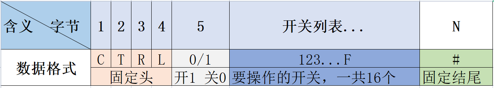

# 双路继电器开关
本项目是基于`ESP8266`的 2 路继电器开关固件，项目基于 PlatformIO 开发，使用了 Arduino 库。
## 协议


## 案例

- 打开开关 1

```
43 54 52 4C 01 01 35
```

- 关闭开关 1

```
43 54 52 4C 00 01 35
```

## 接线

```txt
开关1   ->  GPIO4
开关2   ->  GPIO5
```
## 状态

状态会通过 `串口1` 发送出去, 每个开关用一个字节表示,整个状态用2个字节:

```
00
```

## 调试

调试信息在 `串口0` 输出，可以通过监控 `串口0` 来获取日志。

## 编译

```sh
pio run
```
## 上传
```sh
pio run -e esp12e -t upload --upload-port COM7
```
